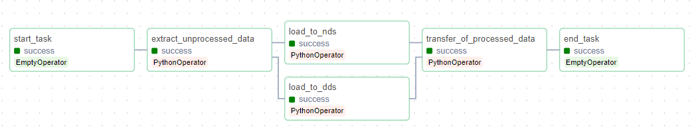

# Дипломаная работа по курсу "DataOps-инженер"

---
## Содержание  
- [1. Введение](#introduction)  
- [2. Анализ данных](#first-stage)  
- [3. Формирование состава таблиц, построение ER-диаграмм и DDL-запросов](#second-stage)  
- [4. Разработка ETL-процессов](#third-stage)  
- [5. Формирование набора метрик и визуализация данных](#fourth-stage)  
- [6. Выводы](#conclusions)  

## <a name="introduction"></a> 1. Введение

В современном информационном мире организации сталкиваются с огромным объемом данных, требующих систематизации, хранения и анализа. Однако, с ростом объемов информации и ее многообразием, эффективное управление данными становится ключевым аспектом успешной деятельности предприятий. В этом контексте концепция DataOps приобретает особую актуальность, объединяя в себе лучшие практики DevOps и принципы управления данными.

Целью данной дипломной работы является разработка и документирование процессов ETL (Extract, Transform, Load) для создания и поддержки хранилища данных. Это хранилище состоит из двух основных слоев: нормализованного хранилища (NDS) и схемы звезда (DDS). Этот процесс обеспечит эффективное хранение и управление данными, что в свою очередь способствует принятию обоснованных бизнес-решений.

На завершающем этапе работы, на основе данных из схемы звезда (DDS), разработан дашборд, предоставляющие наглядное представление ключевых аспектов бизнеса.

Для реализации дипломной работы использовались:
- Дистрибутив Anaconda (Jupiter Lab) - для анализа данных
- Сервис [dbdiagram.io](https://dbdiagram.io/) - для построения ER-диаграмм
- ClickHouse и PostgreSQL (Docker) - для хранения данных
- Apache Airflow (Docker) - для ETL-процессов
- Tableau Desktop - для построения дашборда

---

## <a name="first-stage"></a> 2. Анализ данных

[Датасет](./supermarket_sales.csv)

**Контекст датасета:** датасет `Supermarket Sales` представляет из себя срез исторических данных о продажах товаров в 3 филиалах компании за 3 месяца.

**Атрибуты:**
1. `Invoice ID`: програмно-генерируемый идентификационный номер счета-фактуры
2. `Branch`: название филиала компании
3. `City`: местонахождение филиала (город)
4. `Customer Type`: тип покупателя (наличие клубной карты)
5. `Gender`: пол покупателя
6. `Product Line`: продуктовая линейка
7. `Unit Price`: цена единицы товара в долларах
8. `Quantity`: количество проданных товаров
9. `Tax`: сумма взимаемого налога с продажи (5%)
10. `Total`: общая стоимость продажи, включая налоги
11. `Date`: дата продажи
12. `Time`: время продажи
13. `Payment`: метод оплаты
14. `COGS`: себестоимость проданных товаров
15. `Gross Profit Percentage`: процент прибыли
16. `Gross Revenue`: прибыль с продажи
17. `Rating`: рейтинг покупки от покупателя (по шкале от 1 до 10)

Для анализа данных воспользуемся библиотеками `pandas`, `matplotlib` и `seaborn`.

[Jupyter Notebook](./01.%20Data%20Analysis/notebook.ipynb)

**Загрузка данных в Pandas DataFrame:**

```python
import pandas as pd
import matplotlib.pyplot as plt
import seaborn as sns
```

```python
df = pd.read_csv('supermarket_sales - Sheet1.csv', delimiter=',')
print(df.head(3))
```

```
    Invoice ID Branch       City Customer type  Gender  \
0  750-67-8428      A     Yangon        Member  Female   
1  226-31-3081      C  Naypyitaw        Normal  Female   
2  631-41-3108      A     Yangon        Normal    Male   

             Product line  Unit price  Quantity   Tax 5%     Total      Date  \
0       Health and beauty       74.69         7  26.1415  548.9715  1/5/2019   
1  Electronic accessories       15.28         5   3.8200   80.2200  3/8/2019   
2      Home and lifestyle       46.33         7  16.2155  340.5255  3/3/2019   

    Time      Payment    cogs  gross margin percentage  gross income  Rating  
0  13:08      Ewallet  522.83                 4.761905       26.1415     9.1  
1  10:29         Cash   76.40                 4.761905        3.8200     9.6  
2  13:23  Credit card  324.31                 4.761905       16.2155     7.4  
```

Данные успешно загружены.

**Проверка типов данных, количества строк и Null значений:**
```python
df.info()
```

```
<class 'pandas.core.frame.DataFrame'>
RangeIndex: 1000 entries, 0 to 999
Data columns (total 17 columns):
 #   Column                   Non-Null Count  Dtype  
---  ------                   --------------  -----  
 0   Invoice ID               1000 non-null   object 
 1   Branch                   1000 non-null   object 
 2   City                     1000 non-null   object 
 3   Customer type            1000 non-null   object 
 4   Gender                   1000 non-null   object 
 5   Product line             1000 non-null   object 
 6   Unit price               1000 non-null   float64
 7   Quantity                 1000 non-null   int64  
 8   Tax 5%                   1000 non-null   float64
 9   Total                    1000 non-null   float64
 10  Date                     1000 non-null   object 
 11  Time                     1000 non-null   object 
 12  Payment                  1000 non-null   object 
 13  cogs                     1000 non-null   float64
 14  gross margin percentage  1000 non-null   float64
 15  gross income             1000 non-null   float64
 16  Rating                   1000 non-null   float64
dtypes: float64(7), int64(1), object(9)
memory usage: 132.9+ KB
```

В датафрейме 1000 строк, Null значения отсутствуют.

**Проверка строк на дубликаты:**
```python
df.duplicated().any()
```

```
False
```

Дубликаты отсутствуют.

**Вывод списков представленных филиалов, городов, типов клиентов, методов оплаты и продуктовых линейках:**

```python
print(df['Branch'].unique())
print(df['City'].unique())
print(df['Customer type'].unique())
print(df['Gender'].unique())
print(df['Product line'].unique())
print(df['Payment'].unique())
```

```
['A' 'C' 'B']
['Yangon' 'Naypyitaw' 'Mandalay']
['Member' 'Normal']
['Female' 'Male']
['Health and beauty' 'Electronic accessories' 'Home and lifestyle'
 'Sports and travel' 'Food and beverages' 'Fashion accessories']
['Ewallet' 'Cash' 'Credit card']
```

Категориальные переменные определены.

**Вывод статистики по всем столбцам датафрейма:**

```
df.describe(include='all')
```


Из полученной статистику узнаем:
  1. В данных почти равное распределение как по типу клиента (*Member* / *Normal*), так и по полу (*Female* / *Male*). В обоих случаях это 501 на 499.
  2. Наибольшей популярностью пользуется категория *Fashion accessories*. На нее приходится 178 продаж.
  3. Средняя стоимость единицы товара $55.67.
  4. Среднее количество товаров в покупке 5.51.
  5. Средний налог с продажи $15.38.
  6. Средних доход с продажи $322.97.
  7. Средняя прибыль с продажи $15.38.
  8. Средний рейтинг покупки 6.97 балов.

**Построение столбчатой диаграммы по распределению продаж на филиалы:**

```python
# группировка данных
branch_stat = df.groupby('Branch').nunique().reset_index()

# построение графика
plt.figure(figsize=(3, 4))
sns.set(style="whitegrid")
sns.barplot(x='Branch', y='Invoice ID', data=branch_stat, palette="viridis")

plt.title('Количество продаж по филиалам')
plt.xlabel('Филиал')
plt.ylabel('Количество продаж')

plt.show()
```


Из диаграммы видно, что больше всего продаж приходится на филиал *A*, но в целом распределение почти равное.

**Подсчет средней разницы в количестве продаж между филиалами:**

```python
average_percentage_difference = (branch_stat['Invoice ID'].max() - branch_stat['Invoice ID'].min()) / branch_stat['Invoice ID'].mean() * 100
print('Разница составляет: ', average_percentage_difference.round(3), '%')
```

```
Разница составляет: 3.6 %
```

**Распределение продаж по продуктовым линейкам:**

```python
product_line_stat = df.groupby('Product line')['Invoice ID'].nunique().reset_index()

plt.figure(figsize=(4, 4))
sns.set(style="whitegrid")
sns.barplot(x='Product line', y='Invoice ID', data=product_line_stat, palette="viridis")

plt.title('Количество продаж по категориям товаров')
plt.xlabel('Категория товаров')
plt.ylabel('Количество продаж')
plt.xticks(rotation=45, ha='center')

plt.show()
```


Из полученной диаграммы видно, что наибольшее число продаж приходится на категорию *Fashion Accessories*, наименьшее на категорию *Health and beauty*.

**Построение тепловой карты (город - метод оплаты):**

```python
sns.heatmap(pd.crosstab(df['City'], df['Payment']), cmap="YlGnBu")

plt.title('Тепловая карта по городам и методам оплаты')
plt.xlabel('Метод оплаты')
plt.ylabel('Город')

plt.show()
```


Из полученной карты можно сделать вывод о том, что:
  1. Метод оплаты *Cash* чаще всего используют в городе *Naypyitaw*
  2. Метод оплаты *Credit Card* наиболее часто используют в городе *Mandalay*
  3. Метод оплаты *Ewallet* наиболее часто используют в городе *Yangon*

**Общие выводы:**

По результатам анализа были определены основных характеристики, категориальные признаки, а также выполнена базовая проверка данных на ошибки и `Null` значения.

## <a name="second-stage"></a> 3. Формирование состава таблиц, построение ER-диаграмм и DDL-запросов

#### Нормализованная схема данных (NDS)

**Диаграмма:**


[Диаграмма в dbdiagram.io](https://dbdiagram.io/d/er-diagram-nds-65b0dfbaac844320ae9c65de)

[DDL-запросы для создания и заполнения таблиц в PostgreSQL](./02.%20ER%20and%20DDL/nds_ddl.sql)

В процессе решения данной задачи был сформирован состав таблиц нормализованной схемы данных. Были исключены исчисляемые атрибуты (`tax_amount`, `total`, `cogs`, `gross_income`).

*Нормализация данных помогает уменьшить избыточность информации и повысить эффективность хранения.*


**Нормализованная схема включает в себя следующие таблицы:**
1. Города (`nds.cities`):
    * Таблица для хранения городов.
2. Филиалы (`nds.branches`):
3. Продуктовые линейки (`nds.product_lines`):
    * Таблица для хранения категорий товаров.
4. Способы оплаты (`nds.payment_methods`):
    * Таблица для хранения доступных методов оплаты.
5. Типы клиентов (`nds.customer_types`):
    * Таблица для хранения различных типов клиентов.
6. Продажи (`nds.sales`):
    * Основная таблица для хранения информации о продажах. Отдельные столбцы для даты, времени, цены, количества и других характеристик продажи.
      Внешние ключи связывают записи в этой таблице с соответствующими записями в таблицах городов, филиалов, категорий товаров, способов оплаты и типов клиентов.

#### Таблицы фактов и измерений  по схеме звезда (DDS)

В процессе решения данной задачи был сформирован состав таблиц фактов и измерений по схеме звезда, предназначенной для анализа данных о покупках.

*Схема звезда (Star Schema) представляет собой тип схемы "факты и измерения", где факты (данные о покупках) хранятся в одной основной таблице, а измерения (характеристики покупки) хранятся в отдельных таблицах, соединенных через внешние ключи. Данные в такой схеме денормализованны для увеличения эффективности при запросах.*

**Диаграмма:**


[Диаграмма в dbdiagram.io](https://dbdiagram.io/d/er_diagram_dds-65be9b6fac844320ae60faf1)

[DDL-запросы для создания и заполнения таблиц в PostgreSQL](./02.%20ER%20and%20DDL/dds_ddl.sql)

**Схема звезды включает в себя следующие таблицы:**
1. Города (`dds.cities`):
    * Таблица для хранения городов.
2. Филиалы (`dds.branches`):
    * Таблица для хранения информации о филиалах, ссылающаяся на таблицу городов.
3. Продуктовые линейки (`dds.product_lines`):
    * Таблица для хранения категорий товаров.
4. Способы оплаты (`dds.payment_methods`):
    * Таблица для хранения доступных методов оплаты.
5. Типы клиентов (`dds.customer_types`):
    * Таблица для хранения различных типов клиентов.
6. Дата продажи (`dds.sales_dates`):
    * Таблица для хранения информации о датах продажи, включая элементы дат.
7. Время продажи (`dds.sales_time`):
    * Таблица для хранения информации о времени продажи, включая элементы времени.
8. Рейтинг продаж (`dds.sales_rating`):
    * Таблица для хранения рейтингов продаж.
9. Продажи (`dds.sales`):
    * Основная таблица для хранения фактов о продажах. Содержит информацию о продажах, включая дату, время, место, тип клиента, продукт, стоимость, налог и другие характеристики.
    Связана с таблицами измерений через внешние ключи.

#### Структура и типы данных таблицы для хранения исходных данных

**Диаграмма:**


[Структура в dbdiagram.io](https://dbdiagram.io/d/er-diagram-raw-65bea41cac844320ae613ed2)

[DDL-запросы для создания таблиц в ClickHouse](./02.%20ER%20and%20DDL/raw_ddl.sql)

В данной таблице изменены названия атрибутов, соединены время и дата (преобразованы в тип данных `DateTime`), а также добавлен столбец `insert_time` - фактическое время на момент insert'а строки в таблицу.

## <a name="third-stage"></a> 4. Разработка ETL-процессов

Для решения этой задачи было решено разделить процессы первичной выгрузки данных из источника и перемещение их в требуемые схемы на 2 DAG.

Все окружение для реализации процессов поднято в контейнеризированной среде ([docker-compose.yaml](./03.%20ETL/docker-compose.yaml)).

**Потоковая схема:**


#### Выгрузка данных из источника (Kaggle) и загрузка в ClickHouse

**Краткое описание:** DAG выполняет выгрузку данных из источника (через Kaggle API), валидацию (проверка на `Null` значения, дубликаты строк, наличие валидных значений атрибутов, а также соответствие формата `Invoice ID` регулярному выражению) и преобразование типов (раздельные атрибуты даты и времени преобразовываются в один) и загрузку данных в ClickHouse.

**Код Airflow DAG ([data_load_dag.py](./03.%20ETL/data_load_dag.py)):**
```python
from airflow import DAG
from airflow.operators.python_operator import PythonOperator
from airflow.operators.dummy_operator import DummyOperator
from datetime import datetime, timedelta
from kaggle.api.kaggle_api_extended import KaggleApi
import pandas as pd
from clickhouse_driver import Client

default_args = {
    'owner': 'airflow',
    'depends_on_past': False,
    'start_date': datetime(2024, 2, 1),
    'email_on_failure': False,
    'email_on_retry': False,
    'retries': 1,
    'retry_delay': timedelta(minutes=5)
}

# параметры подключения к ClickHouse
clickhouse_params = {
    'host':'clickhouse',
    'port': 9000,
    'database': 'default'
}

def connect_to_clickhouse(**kwargs):
    '''Функция для подключения к ClickHouse'''
    return Client(host=kwargs['host'],
                  port=kwargs['port'],
                  database=kwargs['database'])

def remove_rows_with_nulls(df):
    '''Функция для очистки датасета от строк, в которых есть значения Null'''
    df_len = df.shape[0]
    df = df.dropna()
    print(f'Проверка значений на Null выполнена (удалено {df_len - df.shape[0]} строк)')
    return df

def validate_data(df, attrv_dict):
    '''Функция для проверки данных в датасете'''
    df_len = df.shape[0]

    # Проверка формата invoice_id
    df = df[df['id'].str.match(r'^\d{3}-\d{2}-\d{4}$')]

    # Проверка допустимых значений для атрибутов
    df = df[df['branch'].isin(attrv_dict['branches'])]
    df = df[df['city'].isin(attrv_dict['cities'])]
    df = df[df['customer_type'].isin(attrv_dict['customer_types'])]
    df = df[df['gender'].isin(attrv_dict['genders'])]
    df = df[df['payment_method'].isin(attrv_dict['payment_methods'])]
    
    print(f'Данные валидированы (удалено {df_len - df.shape[0]} строк)')

    return df

def insert_date_into_clickhouse(clickhouse_client, table_name, column_names, batch_size, df):
    '''Функция для добавления данных в ClickHouse'''
    for i in range(0, len(df), batch_size):
        batch_df = df.iloc[i:i + batch_size]
        print(f'Подготовлен батч размером {batch_df.shape[0]}')
        clickhouse_client.execute(f'INSERT INTO {table_name} ({", ".join(column_names)}) VALUES', batch_df.to_dict(orient='records'))
        print(f'  Загружено {batch_df.shape[0]} строк')

def download_dataset_from_kaggle(**kwargs):
    '''Функция для получения загрузки датасета из Kaggle'''
    api = KaggleApi()
    api.authenticate()
    api.dataset_download_files(kwargs['dataset_id'], kwargs['dataset_path'], unzip=True)
    print('Датасет успешно загружен')

def load_into_clickhouse(**kwargs):
    attrv_dict = {
        'branches' : ['A', 'B', 'C'],
        'cities' : ['Yangon', 'Naypyitaw', 'Mandalay'],
        'customer_types' : ['Member', 'Normal'],
        'genders' : ['Male', 'Female'],
        'payment_methods' : ['Cash', 'Ewallet', 'Credit card'],
    }

    column_names = ['id', 'branch', 'city', 'customer_type', 'gender',
                    'product_line', 'unit_price', 'quantity', 'tax',
                    'total', 'date', 'time', 'payment_method', 'cogs',
                    'gross_margin_percentage', 'gross_income', 'rating']

    df = pd.read_csv(f"{kwargs['dataset_path']}/supermarket_sales - Sheet1.csv", header=None, names=column_names, skiprows=1)
    df = df.applymap(lambda x: x.strip() if isinstance(x, str) else x) # удаление пробелов из значений
    df['datetime'] = pd.to_datetime(df['date'] + ' ' + df['time']) # перевод даты в формат datetime
    df.drop(columns=['date'], inplace=True)  # удаление ненужных столбцов
    df.drop(columns=['time'], inplace=True)
    column_names = df.columns.tolist()

    # удаление строк с Null значениями
    df = remove_rows_with_nulls(df)

    # валидация формата и допустимых значений
    df = validate_data(df, attrv_dict)

    if df.shape[0] > 0:
        # загрузка данных в ClickHouse
        clickhouse_client = connect_to_clickhouse(**kwargs['clickhouse_params'])
        insert_date_into_clickhouse(clickhouse_client, kwargs['table_name'], column_names, kwargs['batch_size'], df)
        clickhouse_client.disconnect()
        print(f'Данные успешно загружены в ClickHouse ({df.shape[0]})')
    else:
        print(f'Данные отсутствуют')

dag = DAG(
    'data_load_dag',
    default_args=default_args,
    description='DAG для извлечения, первичной обработки и перемещения данных',
    #schedule_interval=timedelta(days=1),
    schedule_interval="@daily"
)

start_task = DummyOperator(
    task_id='start_task',
    dag=dag,
)

download_dataset_task = PythonOperator(
    task_id='download_dataset_task',
    python_callable=download_dataset_from_kaggle,
    op_kwargs={'dataset_id': 'aungpyaeap/supermarket-sales','dataset_path': './supermarket-sales'},
    dag=dag,
)

load_unprocessed_data_task = PythonOperator(
    task_id='load_unprocessed_data_task',
    python_callable=load_into_clickhouse,
    op_kwargs={'dataset_path': './supermarket-sales', 'clickhouse_params': clickhouse_params, 'table_name': 'unprocessed_data', 'batch_size': 100},
    dag=dag,
)

end_task = DummyOperator(
    task_id='end_task',
    dag=dag,
)

start_task >> download_dataset_task >> load_unprocessed_data_task >> end_task
```

**Граф задач:**


**Подробное описание задач DAG:**
1. **Начальная задача (`start_task`):**
   - *Тип задачи:* `DummyOperator`
   - *Роль:* Фиктивная задача, обозначающая начало DAG.
2. **Задача загрузки датасета из Kaggle (`download_dataset_task`):**
   - *Тип задачи:* `PythonOperator`
   - *Python-функция:* `download_dataset_from_kaggle`
   - *Параметры:*
      - `dataset_id`: Идентификатор датасета на Kaggle (`'aungpyaeap/supermarket-sales'`).
      - `dataset_path`: Путь для сохранения загруженного датасета (`'./supermarket-sales'`).
   - *Роль:* Загрузка датасета из Kaggle и распаковка в указанную директорию.
3. **Задача загрузки необработанных данных в ClickHouse (`load_unprocessed_data_task`):**
   - *Тип задачи:* `PythonOperator`
   - *Python-функция:* `load_into_clickhouse`
   - *Параметры:*
      - `dataset_path`: Путь к загруженному датасету (`'./supermarket-sales'`).
      - `clickhouse_params`: Параметры подключения к ClickHouse (`clickhouse_params`).
      - `table_name`: Имя таблицы в ClickHouse, куда будут загружены данные (`'unprocessed_data'`).
      - `batch_size`: Размер батча при загрузке данных (`100`).
   - *Роль:* Обработка и валидация данных из датасета, а затем загрузка их в ClickHouse.
4. **Завершающая задача (`end_task`):**
   - *Тип задачи:* `DummyOperator`
   - *Роль:* Фиктивная задача, обозначающая конец DAG.

<details>
    <summary>Лог выполнения</summary>

**`start_task`:**
```bash
*** Operator inherits from empty operator and thus does not have logs
```

**`download_dataset_task`:**
```bash
ca3bffb99254
*** Found local files:
***   * /opt/airflow/logs/dag_id=data_load_dag/run_id=manual__2024-02-03T21:14:51.110555+00:00/task_id=download_dataset_task/attempt=1.log
[2024-02-03, 21:14:56 UTC] {taskinstance.py:1956} INFO - Dependencies all met for dep_context=non-requeueable deps ti=<TaskInstance: data_load_dag.download_dataset_task manual__2024-02-03T21:14:51.110555+00:00 [queued]>
[2024-02-03, 21:14:56 UTC] {taskinstance.py:1956} INFO - Dependencies all met for dep_context=requeueable deps ti=<TaskInstance: data_load_dag.download_dataset_task manual__2024-02-03T21:14:51.110555+00:00 [queued]>
[2024-02-03, 21:14:56 UTC] {taskinstance.py:2170} INFO - Starting attempt 1 of 2
[2024-02-03, 21:14:56 UTC] {taskinstance.py:2191} INFO - Executing <Task(PythonOperator): download_dataset_task> on 2024-02-03 21:14:51.110555+00:00
[2024-02-03, 21:14:56 UTC] {standard_task_runner.py:60} INFO - Started process 168 to run task
[2024-02-03, 21:14:56 UTC] {standard_task_runner.py:87} INFO - Running: ['***', 'tasks', 'run', 'data_load_dag', 'download_dataset_task', 'manual__2024-02-03T21:14:51.110555+00:00', '--job-id', '138', '--raw', '--subdir', 'DAGS_FOLDER/data_load_dag.py', '--cfg-path', '/tmp/tmpsoo30091']
[2024-02-03, 21:14:56 UTC] {standard_task_runner.py:88} INFO - Job 138: Subtask download_dataset_task
[2024-02-03, 21:14:56 UTC] {task_command.py:423} INFO - Running <TaskInstance: data_load_dag.download_dataset_task manual__2024-02-03T21:14:51.110555+00:00 [running]> on host ca3bffb99254
[2024-02-03, 21:14:57 UTC] {taskinstance.py:2480} INFO - Exporting env vars: AIRFLOW_CTX_DAG_OWNER='***' AIRFLOW_CTX_DAG_ID='data_load_dag' AIRFLOW_CTX_TASK_ID='download_dataset_task' AIRFLOW_CTX_EXECUTION_DATE='2024-02-03T21:14:51.110555+00:00' AIRFLOW_CTX_TRY_NUMBER='1' AIRFLOW_CTX_DAG_RUN_ID='manual__2024-02-03T21:14:51.110555+00:00'
[2024-02-03, 21:14:57 UTC] {logging_mixin.py:188} INFO - Warning: Your Kaggle API key is readable by other users on this system! To fix this, you can run 'chmod 600 /home/***/.kaggle/kaggle.json'
[2024-02-03, 21:15:00 UTC] {logging_mixin.py:188} INFO - Датасет успешно загружен
[2024-02-03, 21:15:00 UTC] {python.py:201} INFO - Done. Returned value was: None
[2024-02-03, 21:15:00 UTC] {taskinstance.py:1138} INFO - Marking task as SUCCESS. dag_id=data_load_dag, task_id=download_dataset_task, execution_date=20240203T211451, start_date=20240203T211456, end_date=20240203T211500
[2024-02-03, 21:15:00 UTC] {local_task_job_runner.py:234} INFO - Task exited with return code 0
[2024-02-03, 21:15:00 UTC] {taskinstance.py:3280} INFO - 1 downstream tasks scheduled from follow-on schedule check
```

**`load_unprocessed_data_task`:**
```bash
ca3bffb99254
*** Found local files:
***   * /opt/airflow/logs/dag_id=data_load_dag/run_id=manual__2024-02-03T21:14:51.110555+00:00/task_id=load_unprocessed_data_task/attempt=1.log
[2024-02-03, 21:15:01 UTC] {taskinstance.py:1956} INFO - Dependencies all met for dep_context=non-requeueable deps ti=<TaskInstance: data_load_dag.load_unprocessed_data_task manual__2024-02-03T21:14:51.110555+00:00 [queued]>
[2024-02-03, 21:15:01 UTC] {taskinstance.py:1956} INFO - Dependencies all met for dep_context=requeueable deps ti=<TaskInstance: data_load_dag.load_unprocessed_data_task manual__2024-02-03T21:14:51.110555+00:00 [queued]>
[2024-02-03, 21:15:01 UTC] {taskinstance.py:2170} INFO - Starting attempt 1 of 2
[2024-02-03, 21:15:01 UTC] {taskinstance.py:2191} INFO - Executing <Task(PythonOperator): load_unprocessed_data_task> on 2024-02-03 21:14:51.110555+00:00
[2024-02-03, 21:15:01 UTC] {standard_task_runner.py:60} INFO - Started process 248 to run task
[2024-02-03, 21:15:01 UTC] {standard_task_runner.py:87} INFO - Running: ['***', 'tasks', 'run', 'data_load_dag', 'load_unprocessed_data_task', 'manual__2024-02-03T21:14:51.110555+00:00', '--job-id', '139', '--raw', '--subdir', 'DAGS_FOLDER/data_load_dag.py', '--cfg-path', '/tmp/tmpahekwlpe']
[2024-02-03, 21:15:01 UTC] {standard_task_runner.py:88} INFO - Job 139: Subtask load_unprocessed_data_task
[2024-02-03, 21:15:01 UTC] {task_command.py:423} INFO - Running <TaskInstance: data_load_dag.load_unprocessed_data_task manual__2024-02-03T21:14:51.110555+00:00 [running]> on host ca3bffb99254
[2024-02-03, 21:15:01 UTC] {taskinstance.py:2480} INFO - Exporting env vars: AIRFLOW_CTX_DAG_OWNER='***' AIRFLOW_CTX_DAG_ID='data_load_dag' AIRFLOW_CTX_TASK_ID='load_unprocessed_data_task' AIRFLOW_CTX_EXECUTION_DATE='2024-02-03T21:14:51.110555+00:00' AIRFLOW_CTX_TRY_NUMBER='1' AIRFLOW_CTX_DAG_RUN_ID='manual__2024-02-03T21:14:51.110555+00:00'
[2024-02-03, 21:15:01 UTC] {logging_mixin.py:188} INFO - Проверка значений на Null выполнена (удалено 0 строк)
[2024-02-03, 21:15:01 UTC] {logging_mixin.py:188} INFO - Данные валидированы (удалено 0 строк)
[2024-02-03, 21:15:01 UTC] {logging_mixin.py:188} INFO - Подготовлен батч размером 100
[2024-02-03, 21:15:02 UTC] {logging_mixin.py:188} INFO -   Загружено 100 строк
[2024-02-03, 21:15:02 UTC] {logging_mixin.py:188} INFO - Подготовлен батч размером 100
[2024-02-03, 21:15:02 UTC] {logging_mixin.py:188} INFO -   Загружено 100 строк
[2024-02-03, 21:15:02 UTC] {logging_mixin.py:188} INFO - Подготовлен батч размером 100
[2024-02-03, 21:15:02 UTC] {logging_mixin.py:188} INFO -   Загружено 100 строк
[2024-02-03, 21:15:02 UTC] {logging_mixin.py:188} INFO - Подготовлен батч размером 100
[2024-02-03, 21:15:02 UTC] {logging_mixin.py:188} INFO -   Загружено 100 строк
[2024-02-03, 21:15:02 UTC] {logging_mixin.py:188} INFO - Подготовлен батч размером 100
[2024-02-03, 21:15:02 UTC] {logging_mixin.py:188} INFO -   Загружено 100 строк
[2024-02-03, 21:15:02 UTC] {logging_mixin.py:188} INFO - Подготовлен батч размером 100
[2024-02-03, 21:15:02 UTC] {logging_mixin.py:188} INFO -   Загружено 100 строк
[2024-02-03, 21:15:02 UTC] {logging_mixin.py:188} INFO - Подготовлен батч размером 100
[2024-02-03, 21:15:03 UTC] {logging_mixin.py:188} INFO -   Загружено 100 строк
[2024-02-03, 21:15:03 UTC] {logging_mixin.py:188} INFO - Подготовлен батч размером 100
[2024-02-03, 21:15:03 UTC] {logging_mixin.py:188} INFO -   Загружено 100 строк
[2024-02-03, 21:15:03 UTC] {logging_mixin.py:188} INFO - Подготовлен батч размером 100
[2024-02-03, 21:15:03 UTC] {logging_mixin.py:188} INFO -   Загружено 100 строк
[2024-02-03, 21:15:03 UTC] {logging_mixin.py:188} INFO - Подготовлен батч размером 100
[2024-02-03, 21:15:03 UTC] {logging_mixin.py:188} INFO -   Загружено 100 строк
[2024-02-03, 21:15:03 UTC] {logging_mixin.py:188} INFO - Данные успешно загружены в ClickHouse (1000)
[2024-02-03, 21:15:03 UTC] {python.py:201} INFO - Done. Returned value was: None
[2024-02-03, 21:15:03 UTC] {taskinstance.py:1138} INFO - Marking task as SUCCESS. dag_id=data_load_dag, task_id=load_unprocessed_data_task, execution_date=20240203T211451, start_date=20240203T211501, end_date=20240203T211503
[2024-02-03, 21:15:03 UTC] {local_task_job_runner.py:234} INFO - Task exited with return code 0
[2024-02-03, 21:15:03 UTC] {taskinstance.py:3280} INFO - 0 downstream tasks scheduled from follow-on schedule check
```

**`end_task`:**
```bash
*** Operator inherits from empty operator and thus does not have logs
```
</details>

**Проверка загруженных в ClickHouse данных:**
```sql
--проверка значений загруженных строк
SELECT *
FROM unprocessed_data ud 
WHERE id = '850-41-9669';
```
```
Name                   |Value                 |
-----------------------+----------------------+
id                     |850-41-9669           |
datetime               |2019-03-19 13:25:00   |
city                   |Yangon                |
branch                 |A                     |
customer_type          |Normal                |
gender                 |Female                |
product_line           |Electronic accessories|
unit_price             |75.06                 |
quantity               |9                     |
tax                    |33.777                |
total                  |709.317               |
payment_method         |Ewallet               |
cogs                   |675.54                |
gross_margin_percentage|4.761904762           |
gross_income           |33.777                |
rating                 |6.2                   |
insert_time            |2024-02-03 21:15:02   |
```

```sql
--количество загруженных строк
SELECT count() AS count
FROM unprocessed_data ud;
```
```
Name |Value|
-----+-----+
count|1000 |
```

Данные успешно загружены.

#### Обработка и загрузка данных в NDS и DDS, перемещение исходных данных

**Краткое описание:** DAG выполняет выгрузку данных из источника (таблица исходных данных в ClickHouse), маппинг значений (преобразование в `id`), загрузку данных в NDS и DDS, а также перемещение исходных данных из таблицы `unprocessed_data` в таблицу `processed_data`, очистку таблицы `unprocessed_data`.

**Код Airflow DAG ([data_processing_dag.py](./03.%20ETL/data_processing_dag.py)):**
```python
from airflow import DAG
from airflow.operators.python_operator import PythonOperator
from airflow.operators.dummy_operator import DummyOperator
from datetime import datetime, timedelta
import pandas as pd
from clickhouse_driver import Client
import psycopg2

default_args = {
    'owner': 'airflow',
    'depends_on_past': False,
    'start_date': datetime(2024, 2, 1),
    'email_on_failure': False,
    'email_on_retry': False,
    'retries': 1,
    'retry_delay': timedelta(minutes=5)
}

# параметры подключения к ClickHouse
clickhouse_params = {
    'host':'clickhouse',
    'port': 9000,
    'database': 'default'
}

# параметры подключения к PostgreSQL
postgres_params = {
    'host': 'postgres',
    'port': 5432,
    'user': 'airflow',
    'password': 'airflow',
    'database': 'postgres'
}

# атрибуты для маппинга
column_map = {
    'cities': 'city',
    'branches': 'branch',
    'product_lines': 'product_line',
    'payment_methods': 'payment_method',
    'customer_types': 'customer_type'
}

def connect_to_clickhouse(**kwargs):
    '''Функция для подключения к ClickHouse'''
    return Client(host=kwargs['host'],
                  port=kwargs['port'],
                  database=kwargs['database'])

def connect_to_postgres(**kwargs):
    '''Функция для подключения к PostgreSQL'''
    return psycopg2.connect(host=kwargs['host'],
                            port=kwargs['port'],
                            user=kwargs['user'],
                            password=kwargs['password'],
                            database=kwargs['database'])

def dataframe_values_mapping(postgres_params, schema, column_map, df):
    '''Функция для маппинга значений в id'''
    query = 'SELECT id, name FROM "{}"."{}"'
    values_dict = {}

    postgres_client = connect_to_postgres(**postgres_params)
    cursor = postgres_client.cursor()

    for k, v in column_map.items():
        cursor.execute(query.format(schema, k))
        values_dict = dict(cursor.fetchall())
        df[v] = df[v].map({_v: _k for _k, _v in values_dict.items()})

    cursor.close()
    postgres_client.close()

    print('Маппинг данных успешно выполнен')
    
    return df

def insert_dates(cursor, row, schema):
    '''Функция для заполнения таблицы sakes_dates'''
    query = f"""
             INSERT INTO {schema}.sales_dates (date, year, month, month_name, day, day_of_the_week)
             VALUES ('{row['datetime']}',
                      {row['datetime'].year},
                      {row['datetime'].month},
                     '{row['datetime'].strftime('%B')}',
                      {row['datetime'].day},
                     '{row['datetime'].strftime('%A')}')
             RETURNING id
             """

    cursor.execute(query)
    return cursor.fetchone()[0] # возврат id строки

def insert_time(cursor, row, schema):
    '''Функция для заполнения таблицы sales_time'''
    query = f"""
             INSERT INTO {schema}.sales_time (datetime, hour, minute, second)
             VALUES ('{row['datetime']}',
                      {row['datetime'].hour},
                      {row['datetime'].minute},
                      {row['datetime'].second})
             RETURNING id
             """

    cursor.execute(query)
    return cursor.fetchone()[0] # возврат id строки

def insert_rating(cursor, row, schema):
    '''Функция для заполнения таблицы sales_rating'''
    query = f"""
             INSERT INTO {schema}.sales_rating (rating)
             VALUES ({row['rating']})
             RETURNING id
             """

    cursor.execute(query)
    return cursor.fetchone()[0] # возврат id строки

def extract_unprocessed_data(**kwargs):
    '''Функция для извлечения данных из ClickHouse'''
    clickhouse_client = connect_to_clickhouse(**kwargs['clickhouse_params'])

    # получаем данные из ClickHouse
    data = clickhouse_client.execute(f"SELECT * FROM {kwargs['table_name']} ORDER BY datetime")

    # создаем датафрейм с полученными данными
    df = pd.DataFrame(data, columns=[col[0] for col in clickhouse_client.execute(f"DESCRIBE {kwargs['table_name']}")])

    # используем механизм кросс-коммуникации для передачи данных в другие задачи
    kwargs['ti'].xcom_push(key='unprocessed_data', value=df)

    clickhouse_client.disconnect()

def load_to_nds(**kwargs):
    '''Функция для загрузки данных в PostgreSQL (NDS)'''
    query =  """
             INSERT INTO {}.sales (id, datetime, city_id, branch_id, customer_type_id, gender,
                                       payment_method_id, product_line_id, unit_price, quantity, rating)
             VALUES('{}', '{}', {}, {}, {}, '{}', {}, {}, {}, {}, {})
             """

    # получаем данные
    df = kwargs['ti'].xcom_pull(task_ids='extract_unprocessed_data', key='unprocessed_data')

    # создаем копию датафрейма для маппинга значений
    _df = df.copy()
    _df = dataframe_values_mapping(kwargs['postgres_params'], 
                                   kwargs['schema'],
                                   kwargs['column_map'],
                                   _df)

    postgres_client = connect_to_postgres(**kwargs['postgres_params'])
    cursor = postgres_client.cursor()

    # добавляем данные в таблицу NDS
    for i, row in df.iterrows():
        _row = _df.iloc[i]
        cursor.execute(query.format(kwargs['schema'],
                                    _row['id'],
                                    _row['datetime'],
                                    _row['city'],
                                    _row['branch'],
                                    _row['customer_type'],
                                    _row['gender'],
                                    _row['payment_method'],
                                    _row['product_line'],
                                    _row['unit_price'],
                                    _row['quantity'],
                                    _row['rating']))

    postgres_client.commit()
    cursor.close()
    postgres_client.close()

    print('Загрузка данных в Postgres успешно выполнена')

def load_to_dds(**kwargs):
    '''Функция для загрузки данных в PostgreSQL (DDS)'''
    query =  """
             INSERT INTO {}.sales
             VALUES('{}', {}, {}, {}, {}, {}, '{}', {}, {}, {}, {}, {}, {}, {}, {}, {})
             """

    # получаем данные
    df = kwargs['ti'].xcom_pull(task_ids='extract_unprocessed_data', key='unprocessed_data')

    # создаем копию датафрейма для маппинга значений
    _df = df.copy()
    _df = dataframe_values_mapping(kwargs['postgres_params'], 
                                   kwargs['schema'],
                                   kwargs['column_map'],
                                   _df)

    postgres_client = connect_to_postgres(**kwargs['postgres_params'])
    cursor = postgres_client.cursor()

    # добавляем данные в таблицы DDS
    for i, row in df.iterrows():
        _row = _df.iloc[i]
        date_id = insert_dates(cursor, row, kwargs['schema'])
        time_id = insert_time(cursor, row, kwargs['schema'])
        rating_id = insert_rating(cursor, row, kwargs['schema'])
        cursor.execute(query.format(kwargs['schema'],
                                    _row['id'],
                                    date_id,
                                    time_id,
                                    _row['city'],
                                    _row['branch'],
                                    _row['customer_type'],
                                    _row['gender'],
                                    _row['payment_method'],
                                    _row['product_line'],
                                    rating_id,
                                    _row['unit_price'],
                                    _row['quantity'],
                                    _row['tax'],
                                    _row['total'],
                                    _row['cogs'],
                                    _row['gross_income']))

    postgres_client.commit()
    cursor.close()
    postgres_client.close()

    print('Загрузка данных в Postgres успешно выполнена')

def transfer_of_processed_data(**kwargs):
    transfer_query = 'INSERT INTO {} ({}) VALUES'
    truncate_query = 'TRUNCATE TABLE un{}'

    df = kwargs['ti'].xcom_pull(task_ids='extract_unprocessed_data', key='unprocessed_data')
    df.drop(columns=['insert_time'], inplace=True)

    clickhouse_client = connect_to_clickhouse(**kwargs['clickhouse_params'])

    # загрузка данных в таблицу с обработанными данными
    for i in range(0, len(df), kwargs['batch_size']):
        batch_df = df.iloc[i:i + kwargs['batch_size']]
        print(f'Подготовлен батч размером {batch_df.shape[0]}')
        clickhouse_client.execute(transfer_query.format(kwargs['table_name'], ' ,'.join(df.columns)), batch_df.to_dict(orient='records'))
        print(f'  Загружено {batch_df.shape[0]} строк')

    print('Обработаные данные загружены')

    # очистка таблицы с необработанными данными
    clickhouse_client.execute(truncate_query.format(kwargs['table_name']))
    print('Таблица с необработанными данными очищена')

dag = DAG(
    'data_processing_dag',
    default_args=default_args,
    description='DAG для извлечения, обработки и перемещения данных',
    #schedule_interval=timedelta(days=1),
    schedule_interval="@daily"
)

start_task = DummyOperator(
    task_id='start_task',
    dag=dag,
)

extract_task = PythonOperator(
    task_id='extract_unprocessed_data',
    python_callable=extract_unprocessed_data,
    op_kwargs={'clickhouse_params': clickhouse_params, 'table_name': 'unprocessed_data'},
    provide_context=True,
    dag=dag,
)

load_nds_task = PythonOperator(
    task_id='load_to_nds',
    python_callable=load_to_nds,
    op_kwargs={'postgres_params': postgres_params, 'column_map': column_map, 'schema': 'nds'},
    provide_context=True,
    dag=dag,
)

load_dds_task = PythonOperator(
    task_id='load_to_dds',
    python_callable=load_to_dds,
    op_kwargs={'postgres_params': postgres_params, 'column_map': column_map, 'schema': 'dds'},
    provide_context=True,
    dag=dag,
)

transfer_task = PythonOperator(
    task_id='transfer_of_processed_data',
    python_callable=transfer_of_processed_data,
    op_kwargs={'clickhouse_params': clickhouse_params, 'table_name': 'processed_data', 'batch_size': 100},
    provide_context=True,
    dag=dag,
)

end_task = DummyOperator(
    task_id='end_task',
    dag=dag,
)

start_task >> extract_task >> [load_nds_task, load_dds_task] >> transfer_task >> end_task
```

**Граф задач:**


**Подробное описание задач DAG:**
1. **Начальная задача (`start_task`):**
   - *Тип задачи:* `DummyOperator`
   - *Роль:* Фиктивная задача, обозначающая начало DAG.
2. **Задача извлечения данных из ClickHouse (`extract_task`):**
   - *Тип задачи:* `PythonOperator`
   - *Python-функция:* `extract_unprocessed_data`
   - *Параметры:*
      - `clickhouse_params`: Параметры подключения к ClickHouse (`clickhouse_params`).
      - `table_name`: Имя таблицы с необработанными данными (`'unprocessed_data'`).
   - *Роль:* Извлечение данных из ClickHouse и передача их для дальнейшей обработки.
3. **Задача загрузки данных в PostgreSQL (NDS) (`load_nds_task`):**
   - *Тип задачи:* `PythonOperator`
   - *Python-функция:* `load_to_nds`
   - *Параметры:*
      - `postgres_params`: Параметры подключения к PostgreSQL (`postgres_params`).
      - `column_map`: Словарь для маппинга значений (`column_map`).
      - `schema`: Имя схемы в PostgreSQL (`'nds'`).
   - *Роль:* Загрузка обработанных данных в таблицу PostgreSQL для системы NDS.
4. **Задача загрузки данных в PostgreSQL (DDS) (`load_dds_task`):**
   - *Тип задачи:* `PythonOperator`
   - *Python-функция:* `load_to_dds`
   - *Параметры:*
      - `postgres_params`: Параметры подключения к PostgreSQL (`postgres_params`).
      - `column_map`: Словарь для маппинга значений (`column_map`).
      - `schema`: Имя схемы в PostgreSQL (`'dds'`).
   - *Роль:* Загрузка обработанных данных в таблицы PostgreSQL для системы DDS.
5. **Задача передачи обработанных данных в ClickHouse (`transfer_task`):**
   - *Тип задачи:* `PythonOperator`
   - *Python-функция:* `transfer_of_processed_data`
   - *Параметры:*
      - `clickhouse_params`: Параметры подключения к ClickHouse (`clickhouse_params`).
      - `table_name`: Имя таблицы с обработанными данными (`'processed_data'`).
      - `batch_size`: Размер батча при загрузке данных (`100`).
   - *Роль:* Загрузка обработанных данных в ClickHouse и очистка таблицы с необработанными данными.
6. **Завершающая задача (`end_task`):**
   - *Тип задачи:* `DummyOperator`
   - *Роль:* Фиктивная задача, обозначающая конец DAG.

<details>
    <summary>Лог выполнения</summary>

**`start_task`:**
```bash
*** Operator inherits from empty operator and thus does not have logs
```

**`extract_unprocessed_data`:**
```bash
ca3bffb99254
*** Found local files:
***   * /opt/airflow/logs/dag_id=data_processing_dag/run_id=manual__2024-02-03T21:53:02.139844+00:00/task_id=extract_unprocessed_data/attempt=1.log
[2024-02-03, 21:53:05 UTC] {taskinstance.py:1956} INFO - Dependencies all met for dep_context=non-requeueable deps ti=<TaskInstance: data_processing_dag.extract_unprocessed_data manual__2024-02-03T21:53:02.139844+00:00 [queued]>
[2024-02-03, 21:53:05 UTC] {taskinstance.py:1956} INFO - Dependencies all met for dep_context=requeueable deps ti=<TaskInstance: data_processing_dag.extract_unprocessed_data manual__2024-02-03T21:53:02.139844+00:00 [queued]>
[2024-02-03, 21:53:05 UTC] {taskinstance.py:2170} INFO - Starting attempt 1 of 2
[2024-02-03, 21:53:05 UTC] {taskinstance.py:2191} INFO - Executing <Task(PythonOperator): extract_unprocessed_data> on 2024-02-03 21:53:02.139844+00:00
[2024-02-03, 21:53:05 UTC] {standard_task_runner.py:60} INFO - Started process 811 to run task
[2024-02-03, 21:53:05 UTC] {standard_task_runner.py:87} INFO - Running: ['***', 'tasks', 'run', 'data_processing_dag', 'extract_unprocessed_data', 'manual__2024-02-03T21:53:02.139844+00:00', '--job-id', '140', '--raw', '--subdir', 'DAGS_FOLDER/data_processing_dag.py', '--cfg-path', '/tmp/tmpafvnfrmv']
[2024-02-03, 21:53:05 UTC] {standard_task_runner.py:88} INFO - Job 140: Subtask extract_unprocessed_data
[2024-02-03, 21:53:05 UTC] {task_command.py:423} INFO - Running <TaskInstance: data_processing_dag.extract_unprocessed_data manual__2024-02-03T21:53:02.139844+00:00 [running]> on host ca3bffb99254
[2024-02-03, 21:53:05 UTC] {taskinstance.py:2480} INFO - Exporting env vars: AIRFLOW_CTX_DAG_OWNER='***' AIRFLOW_CTX_DAG_ID='data_processing_dag' AIRFLOW_CTX_TASK_ID='extract_unprocessed_data' AIRFLOW_CTX_EXECUTION_DATE='2024-02-03T21:53:02.139844+00:00' AIRFLOW_CTX_TRY_NUMBER='1' AIRFLOW_CTX_DAG_RUN_ID='manual__2024-02-03T21:53:02.139844+00:00'
[2024-02-03, 21:53:06 UTC] {python.py:201} INFO - Done. Returned value was: None
[2024-02-03, 21:53:06 UTC] {taskinstance.py:1138} INFO - Marking task as SUCCESS. dag_id=data_processing_dag, task_id=extract_unprocessed_data, execution_date=20240203T215302, start_date=20240203T215305, end_date=20240203T215306
[2024-02-03, 21:53:06 UTC] {local_task_job_runner.py:234} INFO - Task exited with return code 0
[2024-02-03, 21:53:06 UTC] {taskinstance.py:3280} INFO - 2 downstream tasks scheduled from follow-on schedule check
```

**`load_to_nds`:**
```bash
ca3bffb99254
*** Found local files:
***   * /opt/airflow/logs/dag_id=data_processing_dag/run_id=manual__2024-02-03T21:53:02.139844+00:00/task_id=load_to_nds/attempt=1.log
[2024-02-03, 21:53:09 UTC] {taskinstance.py:1956} INFO - Dependencies all met for dep_context=non-requeueable deps ti=<TaskInstance: data_processing_dag.load_to_nds manual__2024-02-03T21:53:02.139844+00:00 [queued]>
[2024-02-03, 21:53:09 UTC] {taskinstance.py:1956} INFO - Dependencies all met for dep_context=requeueable deps ti=<TaskInstance: data_processing_dag.load_to_nds manual__2024-02-03T21:53:02.139844+00:00 [queued]>
[2024-02-03, 21:53:09 UTC] {taskinstance.py:2170} INFO - Starting attempt 1 of 2
[2024-02-03, 21:53:09 UTC] {taskinstance.py:2191} INFO - Executing <Task(PythonOperator): load_to_nds> on 2024-02-03 21:53:02.139844+00:00
[2024-02-03, 21:53:09 UTC] {standard_task_runner.py:60} INFO - Started process 834 to run task
[2024-02-03, 21:53:09 UTC] {standard_task_runner.py:87} INFO - Running: ['***', 'tasks', 'run', 'data_processing_dag', 'load_to_nds', 'manual__2024-02-03T21:53:02.139844+00:00', '--job-id', '142', '--raw', '--subdir', 'DAGS_FOLDER/data_processing_dag.py', '--cfg-path', '/tmp/tmp_4ls8fxd']
[2024-02-03, 21:53:09 UTC] {standard_task_runner.py:88} INFO - Job 142: Subtask load_to_nds
[2024-02-03, 21:53:09 UTC] {task_command.py:423} INFO - Running <TaskInstance: data_processing_dag.load_to_nds manual__2024-02-03T21:53:02.139844+00:00 [running]> on host ca3bffb99254
[2024-02-03, 21:53:09 UTC] {taskinstance.py:2480} INFO - Exporting env vars: AIRFLOW_CTX_DAG_OWNER='***' AIRFLOW_CTX_DAG_ID='data_processing_dag' AIRFLOW_CTX_TASK_ID='load_to_nds' AIRFLOW_CTX_EXECUTION_DATE='2024-02-03T21:53:02.139844+00:00' AIRFLOW_CTX_TRY_NUMBER='1' AIRFLOW_CTX_DAG_RUN_ID='manual__2024-02-03T21:53:02.139844+00:00'
[2024-02-03, 21:53:09 UTC] {logging_mixin.py:188} INFO - Маппинг данных успешно выполнен
[2024-02-03, 21:53:11 UTC] {logging_mixin.py:188} INFO - Загрузка данных в Postgres успешно выполнена
[2024-02-03, 21:53:11 UTC] {python.py:201} INFO - Done. Returned value was: None
[2024-02-03, 21:53:11 UTC] {taskinstance.py:1138} INFO - Marking task as SUCCESS. dag_id=data_processing_dag, task_id=load_to_nds, execution_date=20240203T215302, start_date=20240203T215309, end_date=20240203T215311
[2024-02-03, 21:53:11 UTC] {local_task_job_runner.py:234} INFO - Task exited with return code 0
[2024-02-03, 21:53:11 UTC] {taskinstance.py:3280} INFO - 0 downstream tasks scheduled from follow-on schedule check
```

**`load_to_nds`:**
```bash
ca3bffb99254
*** Found local files:
***   * /opt/airflow/logs/dag_id=data_processing_dag/run_id=manual__2024-02-03T21:53:02.139844+00:00/task_id=load_to_dds/attempt=1.log
[2024-02-03, 21:53:08 UTC] {taskinstance.py:1956} INFO - Dependencies all met for dep_context=non-requeueable deps ti=<TaskInstance: data_processing_dag.load_to_dds manual__2024-02-03T21:53:02.139844+00:00 [queued]>
[2024-02-03, 21:53:08 UTC] {taskinstance.py:1956} INFO - Dependencies all met for dep_context=requeueable deps ti=<TaskInstance: data_processing_dag.load_to_dds manual__2024-02-03T21:53:02.139844+00:00 [queued]>
[2024-02-03, 21:53:08 UTC] {taskinstance.py:2170} INFO - Starting attempt 1 of 2
[2024-02-03, 21:53:08 UTC] {taskinstance.py:2191} INFO - Executing <Task(PythonOperator): load_to_dds> on 2024-02-03 21:53:02.139844+00:00
[2024-02-03, 21:53:08 UTC] {standard_task_runner.py:60} INFO - Started process 816 to run task
[2024-02-03, 21:53:08 UTC] {standard_task_runner.py:87} INFO - Running: ['***', 'tasks', 'run', 'data_processing_dag', 'load_to_dds', 'manual__2024-02-03T21:53:02.139844+00:00', '--job-id', '141', '--raw', '--subdir', 'DAGS_FOLDER/data_processing_dag.py', '--cfg-path', '/tmp/tmpi2pksza9']
[2024-02-03, 21:53:08 UTC] {standard_task_runner.py:88} INFO - Job 141: Subtask load_to_dds
[2024-02-03, 21:53:09 UTC] {task_command.py:423} INFO - Running <TaskInstance: data_processing_dag.load_to_dds manual__2024-02-03T21:53:02.139844+00:00 [running]> on host ca3bffb99254
[2024-02-03, 21:53:09 UTC] {taskinstance.py:2480} INFO - Exporting env vars: AIRFLOW_CTX_DAG_OWNER='***' AIRFLOW_CTX_DAG_ID='data_processing_dag' AIRFLOW_CTX_TASK_ID='load_to_dds' AIRFLOW_CTX_EXECUTION_DATE='2024-02-03T21:53:02.139844+00:00' AIRFLOW_CTX_TRY_NUMBER='1' AIRFLOW_CTX_DAG_RUN_ID='manual__2024-02-03T21:53:02.139844+00:00'
[2024-02-03, 21:53:09 UTC] {logging_mixin.py:188} INFO - Маппинг данных успешно выполнен
[2024-02-03, 21:53:11 UTC] {logging_mixin.py:188} INFO - Загрузка данных в Postgres успешно выполнена
[2024-02-03, 21:53:11 UTC] {python.py:201} INFO - Done. Returned value was: None
[2024-02-03, 21:53:11 UTC] {taskinstance.py:1138} INFO - Marking task as SUCCESS. dag_id=data_processing_dag, task_id=load_to_dds, execution_date=20240203T215302, start_date=20240203T215308, end_date=20240203T215311
[2024-02-03, 21:53:11 UTC] {local_task_job_runner.py:234} INFO - Task exited with return code 0
[2024-02-03, 21:53:11 UTC] {taskinstance.py:3280} INFO - 1 downstream tasks scheduled from follow-on schedule check
```

**`transfer_of_processed_data`:**
```bash
ca3bffb99254
*** Found local files:
***   * /opt/airflow/logs/dag_id=data_processing_dag/run_id=manual__2024-02-03T21:53:02.139844+00:00/task_id=transfer_of_processed_data/attempt=1.log
[2024-02-03, 21:53:14 UTC] {taskinstance.py:1956} INFO - Dependencies all met for dep_context=non-requeueable deps ti=<TaskInstance: data_processing_dag.transfer_of_processed_data manual__2024-02-03T21:53:02.139844+00:00 [queued]>
[2024-02-03, 21:53:14 UTC] {taskinstance.py:1956} INFO - Dependencies all met for dep_context=requeueable deps ti=<TaskInstance: data_processing_dag.transfer_of_processed_data manual__2024-02-03T21:53:02.139844+00:00 [queued]>
[2024-02-03, 21:53:14 UTC] {taskinstance.py:2170} INFO - Starting attempt 1 of 2
[2024-02-03, 21:53:14 UTC] {taskinstance.py:2191} INFO - Executing <Task(PythonOperator): transfer_of_processed_data> on 2024-02-03 21:53:02.139844+00:00
[2024-02-03, 21:53:14 UTC] {standard_task_runner.py:60} INFO - Started process 854 to run task
[2024-02-03, 21:53:14 UTC] {standard_task_runner.py:87} INFO - Running: ['***', 'tasks', 'run', 'data_processing_dag', 'transfer_of_processed_data', 'manual__2024-02-03T21:53:02.139844+00:00', '--job-id', '143', '--raw', '--subdir', 'DAGS_FOLDER/data_processing_dag.py', '--cfg-path', '/tmp/tmpeh9olrft']
[2024-02-03, 21:53:14 UTC] {standard_task_runner.py:88} INFO - Job 143: Subtask transfer_of_processed_data
[2024-02-03, 21:53:14 UTC] {task_command.py:423} INFO - Running <TaskInstance: data_processing_dag.transfer_of_processed_data manual__2024-02-03T21:53:02.139844+00:00 [running]> on host ca3bffb99254
[2024-02-03, 21:53:14 UTC] {taskinstance.py:2480} INFO - Exporting env vars: AIRFLOW_CTX_DAG_OWNER='***' AIRFLOW_CTX_DAG_ID='data_processing_dag' AIRFLOW_CTX_TASK_ID='transfer_of_processed_data' AIRFLOW_CTX_EXECUTION_DATE='2024-02-03T21:53:02.139844+00:00' AIRFLOW_CTX_TRY_NUMBER='1' AIRFLOW_CTX_DAG_RUN_ID='manual__2024-02-03T21:53:02.139844+00:00'
[2024-02-03, 21:53:14 UTC] {logging_mixin.py:188} INFO - Подготовлен батч размером 100
[2024-02-03, 21:53:14 UTC] {logging_mixin.py:188} INFO -   Загружено 100 строк
[2024-02-03, 21:53:14 UTC] {logging_mixin.py:188} INFO - Подготовлен батч размером 100
[2024-02-03, 21:53:14 UTC] {logging_mixin.py:188} INFO -   Загружено 100 строк
[2024-02-03, 21:53:14 UTC] {logging_mixin.py:188} INFO - Подготовлен батч размером 100
[2024-02-03, 21:53:14 UTC] {logging_mixin.py:188} INFO -   Загружено 100 строк
[2024-02-03, 21:53:14 UTC] {logging_mixin.py:188} INFO - Подготовлен батч размером 100
[2024-02-03, 21:53:15 UTC] {logging_mixin.py:188} INFO -   Загружено 100 строк
[2024-02-03, 21:53:15 UTC] {logging_mixin.py:188} INFO - Подготовлен батч размером 100
[2024-02-03, 21:53:15 UTC] {logging_mixin.py:188} INFO -   Загружено 100 строк
[2024-02-03, 21:53:15 UTC] {logging_mixin.py:188} INFO - Подготовлен батч размером 100
[2024-02-03, 21:53:15 UTC] {logging_mixin.py:188} INFO -   Загружено 100 строк
[2024-02-03, 21:53:15 UTC] {logging_mixin.py:188} INFO - Подготовлен батч размером 100
[2024-02-03, 21:53:15 UTC] {logging_mixin.py:188} INFO -   Загружено 100 строк
[2024-02-03, 21:53:15 UTC] {logging_mixin.py:188} INFO - Подготовлен батч размером 100
[2024-02-03, 21:53:15 UTC] {logging_mixin.py:188} INFO -   Загружено 100 строк
[2024-02-03, 21:53:15 UTC] {logging_mixin.py:188} INFO - Подготовлен батч размером 100
[2024-02-03, 21:53:15 UTC] {logging_mixin.py:188} INFO -   Загружено 100 строк
[2024-02-03, 21:53:15 UTC] {logging_mixin.py:188} INFO - Подготовлен батч размером 100
[2024-02-03, 21:53:15 UTC] {logging_mixin.py:188} INFO -   Загружено 100 строк
[2024-02-03, 21:53:15 UTC] {logging_mixin.py:188} INFO - Обработаные данные загружены
[2024-02-03, 21:53:16 UTC] {logging_mixin.py:188} INFO - Таблица с необработанными данными очищена
[2024-02-03, 21:53:16 UTC] {python.py:201} INFO - Done. Returned value was: None
[2024-02-03, 21:53:16 UTC] {taskinstance.py:1138} INFO - Marking task as SUCCESS. dag_id=data_processing_dag, task_id=transfer_of_processed_data, execution_date=20240203T215302, start_date=20240203T215314, end_date=20240203T215316
[2024-02-03, 21:53:16 UTC] {local_task_job_runner.py:234} INFO - Task exited with return code 0
[2024-02-03, 21:53:17 UTC] {taskinstance.py:3280} INFO - 0 downstream tasks scheduled from follow-on schedule check
```

**`end_task`:**
```bash
*** Operator inherits from empty operator and thus does not have logs
```
</details>

**Проверка наличия данных в схемах и их корректность:**
```sql
--проверка загруженных данных в NDS
SELECT p.id AS invoice_id,
       p.datetime,
       c."name" AS city,
       b."name" AS branch,
       ct."name" AS customer_type,
       pm."name" AS payment_method,
       pl."name" AS product_line,
       p.gender,
       p.unit_price,
       p.quantity,
       p.unit_price * p.quantity AS cogs,
       p.tax_percentage,
       p.unit_price * p.quantity / 100 * p.tax_percentage AS tax_amout,
       (p.unit_price * p.quantity) + (p.unit_price * p.quantity / 100 * p.tax_percentage) AS total,
       p.gross_margin_percentage,
       ((p.unit_price * p.quantity) + (p.unit_price * p.quantity / 100 * p.tax_percentage)) / 100 * p.gross_margin_percentage AS gross_income,
       p.rating
FROM nds.sales p
LEFT JOIN nds.cities c ON p.city_id = c.id
LEFT JOIN nds.branches b ON p.branch_id = b.id
LEFT JOIN nds.customer_types ct ON p.customer_type_id = ct.id
LEFT JOIN nds.payment_methods pm ON p.payment_method_id = pm.id
LEFT JOIN nds.product_lines pl ON p.product_line_id = pl.id
WHERE p.id = '761-49-0439';
```

```
Name                   |Value                  |
-----------------------+-----------------------+
invoice_id             |761-49-0439            |
datetime               |2019-01-19 10:17:00.000|
city                   |Mandalay               |
branch                 |B                      |
customer_type          |Member                 |
payment_method         |Ewallet                |
product_line           |Electronic accessories |
gender                 |Female                 |
unit_price             |12.1                   |
quantity               |8                      |
cogs                   |96.8                   |
tax_percentage         |5.0                    |
tax_amout              |4.84                   |
total                  |101.64                 |
gross_margin_percentage|4.761905               |
gross_income           |4.8400002419999995     |
rating                 |8.6                    |
```

```sql
--количество загруженных строк в NDS
SELECT count(*)
FROM nds.sales;
```
```
Name |Value|
-----+-----+
count|1000 |
```

```sql
--проверка загруженных данных в DDS
SELECT p.id AS invoice_id,
       sd."date",
       sd."year",
       sd."month",
       sd."day",
       sd."day_of_the_week",
       st.datetime::time AS "time",
       c."name" AS city,
       b."name" AS branch,
       ct."name" AS customer_type,
       pm."name" AS payment_method,
       pl."name" AS product_line,
       sr.rating,
       p.gender,
       p.unit_price,
       p.quantity,
       p.tax_amount,
       p.total,
       p.cogs,
       p.gross_income
FROM dds.sales p
LEFT JOIN dds.sales_dates sd ON p.date_id = sd.id
LEFT JOIN dds.sales_time st ON p.time_id = st.id
LEFT JOIN dds.cities c ON p.city_id = c.id
LEFT JOIN dds.branches b ON p.branch_id = b.id
LEFT JOIN dds.customer_types ct ON p.customer_type_id = ct.id
LEFT JOIN dds.payment_methods pm ON p.payment_method_id = pm.id
LEFT JOIN dds.product_lines pl ON p.product_line_id = pl.id
LEFT JOIN dds.sales_rating sr ON p.rating_id = sr.id
WHERE p.id = '253-12-6086';
```
```
Name           |Value            |
---------------+-----------------+
invoice_id     |253-12-6086      |
date           |2019-03-12       |
year           |2019             |
month          |3                |
day            |12               |
day_of_the_week|Tuesday          |
time           |12:43:00         |
city           |Yangon           |
branch         |A                |
customer_type  |Member           |
payment_method |Credit card      |
product_line   |Sports and travel|
rating         |8.7              |
gender         |Female           |
unit_price     |98.4             |
quantity       |7                |
tax_amount     |34.44            |
total          |723.24           |
cogs           |688.8            |
gross_income   |34.44            |
```

```sql
--количество загруженных строк в DDS
SELECT count(*)
FROM dds.sales;
```
```
Name |Value|
-----+-----+
count|1000 |
```

```sql
--проверка очистки исходных данных из таблицы unprocessed_data
SELECT count() AS count
FROM unprocessed_data ud;
```
```
Name |Value|
-----+-----+
count|0    |
```

```sql
--проверка перемещения данных в таблицу processed_data
SELECT count() AS count
FROM processed_data pd;
```
```
Name |Value|
-----+-----+
count|1000 |
```

Данные успешно преобразованны, добавлены в схемы NDS и DDS, и перемещенны в историческую таблицу.

## <a name="fourth-stage"></a> 5. Формирование набора метрик и визуализация данных

Выбор метрик для построения дашборда преследовал цель повысить эффективность мониторинга ключевых аспектов бизнеса и обеспечить более глубокое понимание его производительности: от финансовых показателей и эффективности продаж до взаимодействия с клиентами и качества обслуживания. Они позволяют принимать более обоснованные решения и улучшать общую эффективность компании.

**[Tableau Workbook](./04.%20BI/tableau_workbook.twb)**

**Выбранные метрики:**
1. **Общая выручка компании:**
    - *Цель:* Оценить общую финансовую производительность компании.
    - *Инсайты:* Позволяет оценить общий объем денежных средств, поступающих в компанию.
2. **Налог с выручки:**
    - *Цель:* Обеспечить контроль за налоговой обязанностью компании и ее финансовой устойчивостью.
    - *Инсайты:* Позволяет контролировать налоговую обязанность компании и оценивать долю выручки, уходящую на налоги.
3. **Общая прибыль:**
    - *Цель:* Измерить общую прибыль и оценить финансовую эффективность бизнеса.
    - *Инсайты:* Позволяет оценить финансовую эффективность бизнеса и его прибыльность.
4. **Количество выполненных продаж:**
    - *Цель:* Оценить активность продаж и популярность товаров или услуг.
    - *Инсайты:* Помогает оценить активность продаж.
5. **Пол покупателей:**
    - *Цель:* Анализ гендерного распределения клиентов.
    - *Инсайты:* Позволяет выявить предпочтения и поведение покупателей в зависимости от пола.
6. **Способ оплаты покупки:**
    - *Цель:* Изучение предпочтений клиентов по методам оплаты.
    - *Инсайты:* Помогает определить популярные методы оплаты и оптимизировать процессы оплаты
7. **Тип клиента (наличие клубной карты):**
    - *Цель:* Анализ клиентской базы и их участие в программе лояльности.
    - *Инсайты:* Позволяет оценить эффективность программы лояльности и влияние на поведение клиентов.
8. **Прибыль по категориям товаров:**
    - *Цель:* Оценка прибыльности различных категорий товаров.
    - *Инсайты:* Позволяет выделить наиболее прибыльные категории товаров и принимать решения по ассортименту.
9. **Выручка по филиалам:**
    - *Цель:* Измерение доли выручки, генерируемой каждым филиалом.
    - *Инсайты:* Позволяет выявить ключевые источники выручки и фокусироваться на успешных филиалах.
10. **Средний рейтинг от клиентов по категориям товаров:**
    - *Цель:* Оценка удовлетворенности клиентов различными категориями товаров.
    - *Инсайты:* Помогает выделить популярные категории среди клиентов и принимать решения по улучшению ассортимента.
11. **Количество продаж по филиалам:**
    - *Цель:* Измерение активности клиентов в различных филиалах.
    - *Инсайты:* Помогает выявить факторы, влияющие на количество продаж в каждом филиале.
12. **Средний рейтинг филиалов:**
    - *Цель:* Оценка удовлетворенности клиентов работой различных филиалов.
    - *Инсайты:* Позволяет выявить факторы, влияющие на удовлетворенность клиентов, и принимать меры по улучшению сервиса.
13. **Количество проданных товаров по категориям:**
    - *Цель:* Измерение популярности конкретных категорий товаров.
    - *Инсайты:* Помогает анализировать спрос на товары и оптимизировать их предложение.

**Подключение источника данных в Tableau:**


**Итоговый дашборд:**


## <a name="conclusions"></a> 6. Выводы

**В ходе выполнения дипломной работы было выполнено:**

1. **Обработка и анализ данных:**
   - Проанализировали предоставленные данные и проверили их на ошибки.
2. **Нормализованная схема данных (NDS):**
   - Разработали структурированную нормализованную схему данных, обеспечивающую эффективное хранение и управление информацией.
3. **Таблицы фактов и измерений (DDS):**
   - Создали таблицы фактов и измерений, сформировав структуру схемы звезда для легкого доступа к ключевым показателям бизнеса.
4. **ETL-процессы:**
   - Разработали ETL-процессы для загрузки данных в NDS и DDS, обеспечивая эффективный и автоматизированный поток данных.
5. **Дашборды в Tableau:**
   - Построили дашборды в Tableau, визуализируя ключевые метрики, такие как общая выручка, прибыль, количество продаж, рейтинги и другие.

**Решенные бизнес-задачи:**
1. **Управление финансами:**
    - Мониторинг общей выручки компании и её филиалов.
    - Оценка общей прибыли и налога с выручки.
2. **Анализ продаж:**
   - Определение эффективности продаж в разрезе филиалов.
   - Изучение популярности продуктовых линеек.
3. **Понимание клиентского поведения:**
   - Анализ пола покупателей и их предпочтений в способах оплаты.
   - Выявление влияния наличия карты клиента.
4. **Оптимизация ассортимента и рейтингов:**
   - Ранжирование продуктовых линеек по прибыли и продажам.
   - Оценка среднего рейтинга от клиентов по категориям товаров и филиалам.

**Итог работы:** данная работа позволила закрепить полученные навыки в процессе прохождения курса. Полученный результат позволяет бизнесу эффективно управлять финансами, анализировать ключевые показатели продаж и клиентское поведение, принимать обоснованные решения для оптимизации бизнес-процессов и улучшения стратегии развития.
