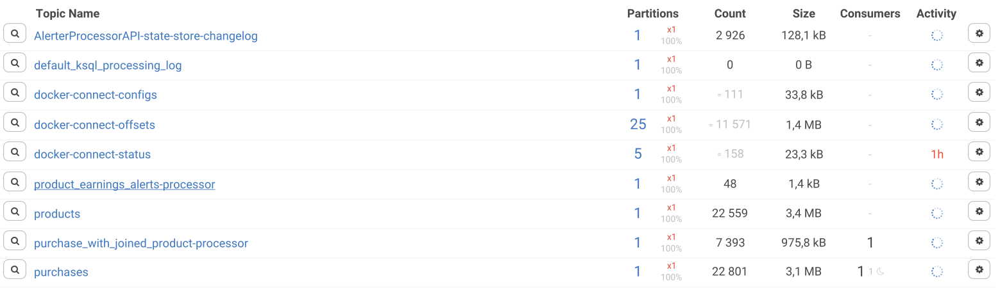
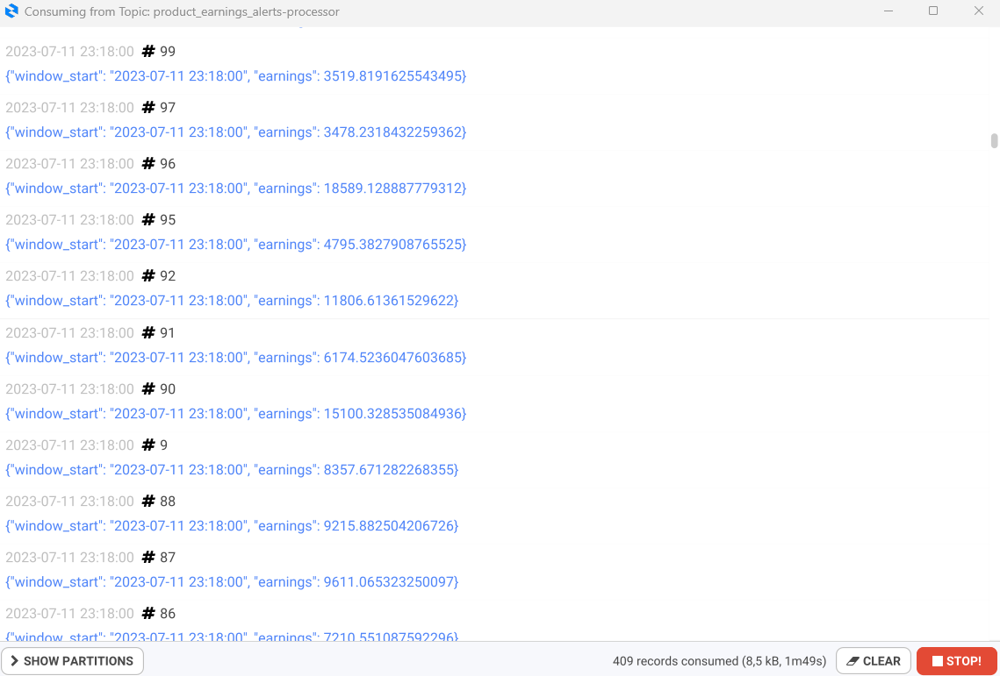

## Домашнее задание по теме: "Kafka Streams 2"

1. Написать приложение, которое будет отправлять сообщение-алерт, если сумма денег заработанных по этому продукту (для каждой покупки сумма - это purchase.quantity * product.price) за последнюю минуту больше 3 000.
Для генерации данных использовать файлы purchase.avsc и product.avsc из репозитория.

    #### Результат:

    Реализация доступна в репозитории [kafka-streams-netology](https://github.com/ivanmanokhin/kafka-streams-netology)

    Созданные топики:
    

    Алерты:
    