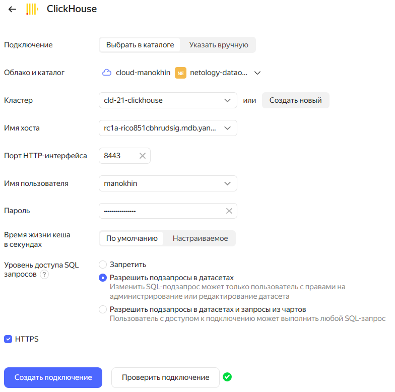
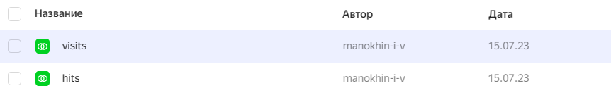
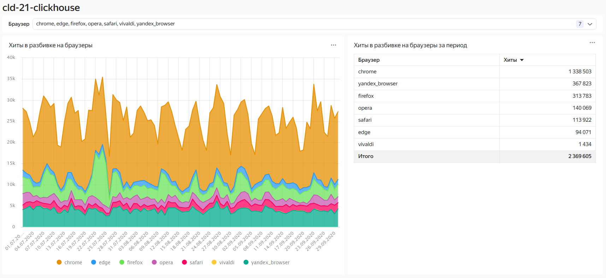

## Домашнее задание по теме: "Хранение и анализ данных в Yandex.Cloud"

1. Создайте кластер Managed Clickhouse - тип b2.medium, размех хранилища 30ГБ SSD, хост с публичным доступом

    #### Результат:

    Создание кластера Managed Clickhouse:
    ```
    yc managed-clickhouse cluster create \
      --name cld-21-clickhouse \
      --environment prestable \
      --network-name clickhouse \
      --host type=clickhouse,`
            `zone-id=ru-central1-a,`
            `subnet-id=e9b2ikbvru6n1atjaign,`
            `assign-public-ip=true \
      --clickhouse-resource-preset b2.medium \
      --clickhouse-disk-type network-ssd \
      --clickhouse-disk-size 30 \
      --user name=manokhin,password=*** \
      --database name=metrica_data \
      --datalens-access
    done (5m45s)
    id: c9q10kqa3r57jd4i5gum
    folder_id: b1g7sqtdcf0ldg35mokk
    created_at: "2023-07-15T15:41:51.102766Z"
    name: cld-21-clickhouse
    environment: PRESTABLE
    monitoring:
      - name: Console
        description: Console charts
        link: https://console.cloud.yandex.ru/folders/b1g7sqtdcf0ldg35mokk/managed-clickhouse/cluster/c9q10kqa3r57jd4i5gum/monitoring
    config:
      version: "23.3"
      clickhouse:
        config:
          effective_config:
            log_level: DEBUG
            merge_tree:
              replicated_deduplication_window: "100"
              replicated_deduplication_window_seconds: "604800"
              parts_to_delay_insert: "150"
              parts_to_throw_insert: "300"
              max_replicated_merges_in_queue: "16"
              number_of_free_entries_in_pool_to_lower_max_size_of_merge: "8"
              max_bytes_to_merge_at_min_space_in_pool: "1048576"
              ttl_only_drop_parts: false
            kafka: {}
            rabbitmq: {}
            max_connections: "4096"
            max_concurrent_queries: "500"
            keep_alive_timeout: "3"
            uncompressed_cache_size: "8589934592"
            mark_cache_size: "5368709120"
            max_table_size_to_drop: "53687091200"
            max_partition_size_to_drop: "53687091200"
            builtin_dictionaries_reload_interval: "3600"
            timezone: Europe/Moscow
            query_log_retention_size: "1073741824"
            query_log_retention_time: "2592000000"
            query_thread_log_enabled: true
            query_thread_log_retention_size: "536870912"
            query_thread_log_retention_time: "2592000000"
            part_log_retention_size: "536870912"
            part_log_retention_time: "2592000000"
            metric_log_enabled: true
            metric_log_retention_size: "536870912"
            metric_log_retention_time: "2592000000"
            trace_log_enabled: true
            trace_log_retention_size: "536870912"
            trace_log_retention_time: "2592000000"
            text_log_enabled: false
            text_log_retention_size: "536870912"
            text_log_retention_time: "2592000000"
            text_log_level: TRACE
          user_config:
            merge_tree: {}
            kafka: {}
            rabbitmq: {}
          default_config:
            log_level: DEBUG
            merge_tree:
              replicated_deduplication_window: "100"
              replicated_deduplication_window_seconds: "604800"
              parts_to_delay_insert: "150"
              parts_to_throw_insert: "300"
              max_replicated_merges_in_queue: "16"
              number_of_free_entries_in_pool_to_lower_max_size_of_merge: "8"
              max_bytes_to_merge_at_min_space_in_pool: "1048576"
              ttl_only_drop_parts: false
            kafka: {}
            rabbitmq: {}
            max_connections: "4096"
            max_concurrent_queries: "500"
            keep_alive_timeout: "3"
            uncompressed_cache_size: "8589934592"
            mark_cache_size: "5368709120"
            max_table_size_to_drop: "53687091200"
            max_partition_size_to_drop: "53687091200"
            builtin_dictionaries_reload_interval: "3600"
            timezone: Europe/Moscow
            query_log_retention_size: "1073741824"
            query_log_retention_time: "2592000000"
            query_thread_log_enabled: true
            query_thread_log_retention_size: "536870912"
            query_thread_log_retention_time: "2592000000"
            part_log_retention_size: "536870912"
            part_log_retention_time: "2592000000"
            metric_log_enabled: true
            metric_log_retention_size: "536870912"
            metric_log_retention_time: "2592000000"
            trace_log_enabled: true
            trace_log_retention_size: "536870912"
            trace_log_retention_time: "2592000000"
            text_log_enabled: false
            text_log_retention_size: "536870912"
            text_log_retention_time: "2592000000"
            text_log_level: TRACE
        resources:
          resource_preset_id: b2.medium
          disk_size: "32212254720"
          disk_type_id: network-ssd
      zookeeper:
        resources: {}
      backup_window_start:
        hours: 22
        minutes: 15
        seconds: 30
        nanos: 100
      access:
        data_lens: true
      cloud_storage: {}
      sql_database_management: false
      sql_user_management: false
      embedded_keeper: false
    network_id: enp7rqrrfimnt3e1qtja
    status: RUNNING
    maintenance_window:
      anytime: {}
    ```

2. Включите дополнительно доступ к datalens и доступ к из консоли управления

    #### Результат:

    Включено при создании через `yc cli`.

3. Загрузите в Clickhouse данные датасетов хитов и визитов тестовых данных Яндекс.Метрики

    #### Результат:
    Данные загружены. Шаги в [jupyter notebook файле](./clickhouse.ipynb)

    Хиты:
    ```sql
    SELECT *
    FROM metrica_data.hits
    LIMIT 5;
    ```

    ```
    Browser|ClientID            |EventDate |EventTime          |DeviceCategory|TraficSource|OSRoot |URL                                     |
    -------+--------------------+----------+-------------------+--------------+------------+-------+----------------------------------------+
    chrome |15861761025842186176|2020-09-07|2020-09-07 13:18:12|1             |ad          |windows|https://supermarket.ru/                 |
    chrome |15861761025842186176|2020-09-07|2020-09-07 13:18:26|1             |internal    |windows|https://supermarket.ru/promo_actions    |
    chrome |15861761025842186176|2020-09-07|2020-09-07 13:18:30|1             |internal    |windows|https://supermarket.ru/promo_action_2246|
    chrome |15861761025842186176|2020-09-07|2020-09-07 13:18:33|1             |internal    |windows|https://supermarket.ru/promo_actions    |
    chrome |15861761025842186176|2020-09-07|2020-09-07 13:18:47|1             |internal    |windows|https://supermarket.ru/promo_action_2246|
    ```

    Визиты:
    ```sql
    SELECT *
    FROM metrica_data.visits
    LIMIT 5;
    ```

    ```
    Browser      |ClientID            |StartDate |StartTime          |DeviceCategory|TraficSource|OSRoot    |Purchases|Revenue|StartURL                                |
    -------------+--------------------+----------+-------------------+--------------+------------+----------+---------+-------+----------------------------------------+
    chromemobile |14999890225593313570|2020-08-25|2020-08-25 04:02:28|             2|referral    |android   |        0|    0.0|https://supermarket.ru/product_1174     |
    chromemobile |14999890225593313570|2020-08-25|2020-08-25 07:42:36|             2|referral    |android   |        0|    0.0|https://supermarket.ru/product_1174     |
    safari_mobile| 3544331103949751830|2020-08-05|2020-08-05 11:31:44|             2|direct      |ios_double|        0|    0.0|https://supermarket.ru/other            |
    chromemobile | 9741288261938210335|2020-07-16|2020-07-16 18:59:53|             2|referral    |android   |        0|    0.0|https://supermarket.ru/promo_action_1418|
    yandexsearch |  279992270269369846|2020-09-09|2020-09-09 15:26:02|             3|direct      |android   |        0|    0.0|https://supermarket.ru/promo_action_4464|
    ```

4. Подключите Datalens к кластеру и подключите таблицы как датасеты

    #### Результат:

    Подключение DataLens к Clickhouse:
    

    Датасеты:
    


5. Сделайте дашборд который покажет как хиты распределяются по браузерам на графике и суммарно.

    #### Результат:

    Дашборд:
    