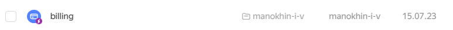
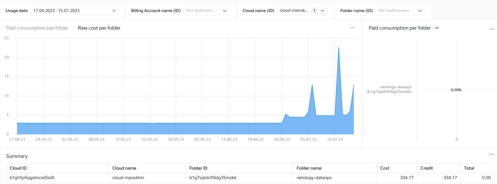

## Домашнее задание по теме: "Прогнозирование затрат и оптимизация расходов в Yandex.Cloud"

1. Подключайте согласно документации

    #### Результат:

    Подключение DataLens к биллингу:
    

1. Найдите в нем folder в котором вы произвели наибольшие траты. Так как у вас используется грант используйте поле Raw consumption

    #### Результат:

    Дашборд с информацией о затратах по folder:
    

    Наибольшие затраты в folder: `netology-dataops`
