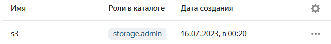
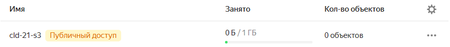
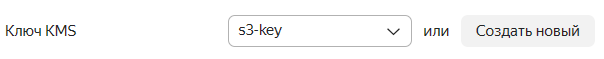
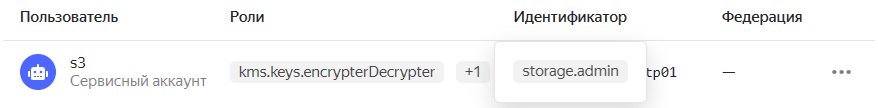
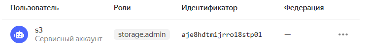

## Домашнее задание по теме: "Обеспечение безопасности в Yandex.Cloud"

### Задание: Зашифровать бакет с помощью kms и убедится что только авторизованные сервисные аккаунты имеют туда доступ

1. Создайте сервисный аккаунт для s3 с ролью storage.admin на фолдере и публичный s3 бакет (не включайте в нем шифрование)

    #### Результат:

    

    

2. Загрузите в бакет какой-нибудь объект (назовите его FIRST) с помощью статических ключей сервисного аккаунта и настроенной утилиты s3cmd или aws-cli для этого (метод put)

    #### Результат:

    ```
    s3cmd put FIRST s3://cld-21-s3
    upload: 'FIRST' -> 's3://cld-21-s3/FIRST'  [1 of 1]
     2 of 2   100% in    0s     5.71 B/s  done
    ```

    ```
    s3cmd ls s3://cld-21-s3
    2023-07-15 21:32            0  s3://cld-21-s3/FIRST
    ```

3. Создайте ключ kms и дайте сервисному аккаунту для s3 роль kms.keys.encrypterDecrypter на фолдер

    #### Результат:

    

    

4. Загрузите в бакет еще один объект (назовите его SECOND) (метод put)

    #### Результат:

    ```
    s3cmd put SECOND s3://cld-21-s3
    upload: 'SECOND' -> 's3://cld-21-s3/SECOND'  [1 of 1]
     2 of 2   100% in    0s     5.01 B/s  done
    ```

    ```
    s3cmd ls s3://cld-21-s3
    2023-07-15 21:40            2  s3://cld-21-s3/FIRST
    2023-07-15 21:41            2  s3://cld-21-s3/SECOND
    ```

5. Попробуйте прочитать оба объекта с помощью команды get используя aws-cli или s3cmd

    #### Результат:

    ```
    s3cmd get s3://cld-21-s3/FIRST
    download: 's3://cld-21-s3/FIRST' -> 'FIRST'  [1 of 1]
     2 of 2   100% in    0s     2.52 B/s  done
    ```

    ```
    s3cmd get s3://cld-21-s3/SECOND
    download: 's3://cld-21-s3/SECOND' -> './SECOND'  [1 of 1]
     2 of 2   100% in    0s     4.15 B/s  done
    ```

6. Отзовите роль kms.encrypterDecrypter у сервисного аккаунта для доступа в s3

    #### Результат:

    

7. Попробуйте прочитать оба объекта еще раз используя aws-cli или s3cmd. У вас не должно быть возможности прочитать объект SECOND

    #### Результат:

    ```
    s3cmd get s3://cld-21-s3/FIRST
    download: 's3://cld-21-s3/FIRST' -> './FIRST'  [1 of 1]
     2 of 2   100% in    1s     1.82 B/s  done
    ```

    ```
    s3cmd get s3://cld-21-s3/SECOND
    download: 's3://cld-21-s3/SECOND' -> './SECOND'  [1 of 1]
    ERROR: Download of './SECOND' failed (Reason: 403 (AccessDenied): Access Denied)
    ERROR: S3 error: 403 (AccessDenied): Access Denied
    ```

8. Также попробуйте обратится через интернет (например curl по прямой ссылке объекта) в оба объекта - у вас должен быть доступ в объект, а во второй быть не должно

    #### Результат:

    ```
    curl storage.yandexcloud.net/cld-21-s3/FIRST
    1
    ```

    ```
    curl storage.yandexcloud.net/cld-21-s3/SECOND
    <?xml version="1.0" encoding="UTF-8"?>
    <Error><Code>AccessDenied</Code><Message>Access Denied</Message><Resource>/cld-21-s3/SECOND</Resource><RequestId>2686cbe2104cf24f</RequestId></Error>
    ```